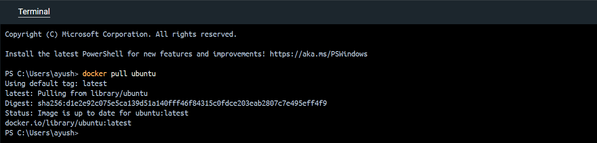
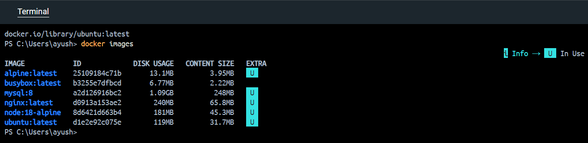
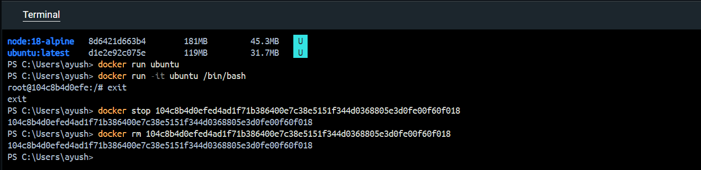

# Docker CLI

### Downloads the Ubuntu image from Docker Hub
```bash
docker pull ubuntu
```

### Lists all downloaded images
```bash
docker images
```

### Creates and runs a container from the Ubuntu image
```bash
docker run ubuntu
```
### Runs Ubuntu with terminal access
```bash
docker run -it ubuntu /bin/bash
```
### Stops a running container
```bash
docker stop <container_id>
```

### Removes a container
```bash
docker rm <container_id>
```
### Deletes the Ubuntu image
```bash
docker rmi ubuntu
```
### Cleans unused containers, images, and networks
```bash
docker system prune -a
```
### Nuclear Clean
```bash
docker system prune -a –volumes
```
