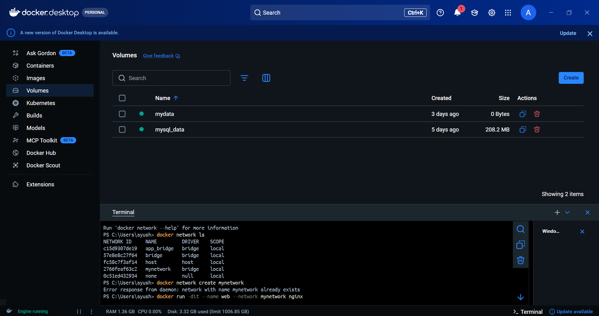
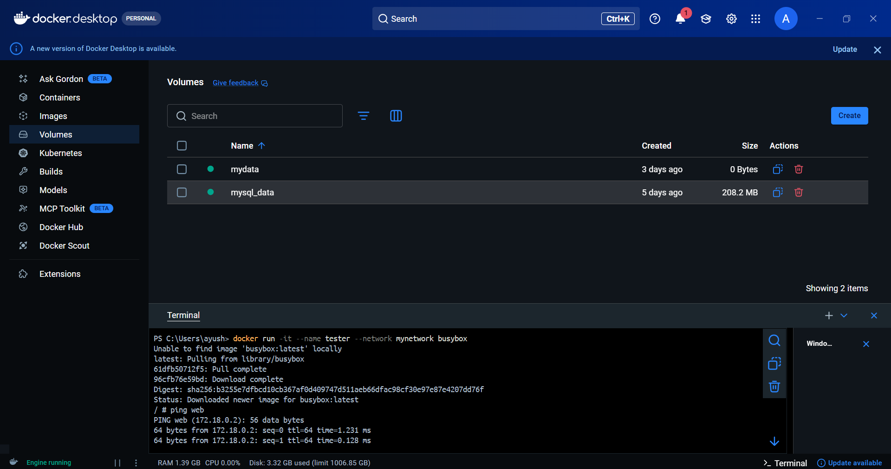
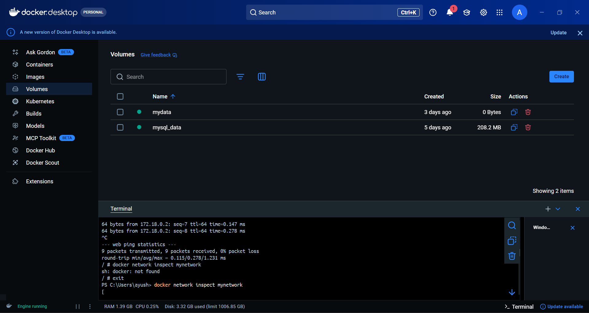
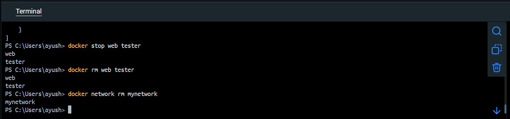

# Docker Networking

Docker Networking allows containers to communicate with each other, the host system, and external networks. It provides isolated network environments so multiple containers can run applications and still exchange data securely.
In Docker, each container can be connected to one or more virtual networks created by Docker. These networks allow containers to communicate using IP addresses or container names.

## Common Docker Network Types

> 1. Bridge Network
The default network type used for containers running on a single host. Containers connected to the same bridge network can communicate with each other.

> 2. Host Network
The container shares the host system’s network stack, meaning it uses the host’s IP address directly.

> 3. None Network
Disables networking for a container, meaning it cannot communicate with other containers or networks.

> 4. Overlay Network
Used for communication between containers running on multiple Docker hosts (commonly used in Docker Swarm).

### Create a Custom Network
```bash
docker network create mynetwork
```

### Check Existing Networks
```bash
docker network ls
```
Now you'll see:
mynetwork


### Run First Container
```bash
docker run -dit --name web --network mynetwork nginx
```

### Run Second Container
```bash
docker run -it --name tester --network mynetwork busybox
```
### Test Container Communication
```bash
ping web
```

### Check Network Details
```bash
docker network inspect mynetwork
```


### Cleanup
```bash
docker stop web tester
docker rm web tester
docker network rm mynetwork
```

