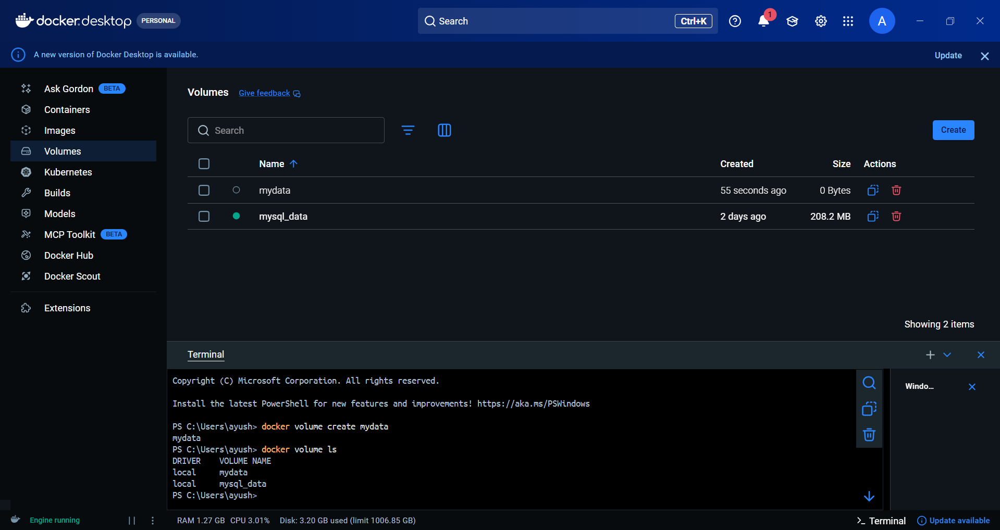
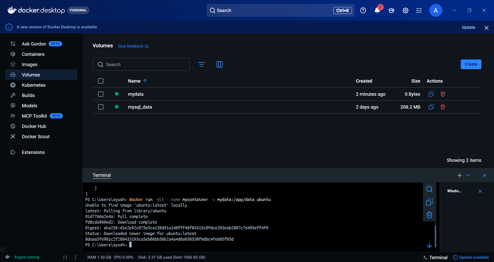
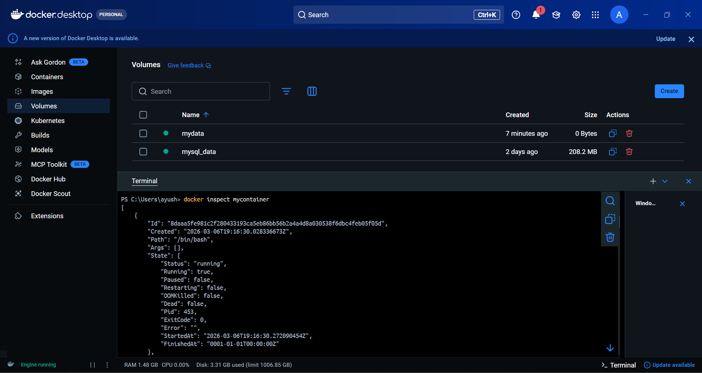

# Docker Volumes:

### Create a Docker volume
```bash
docker volume create mydata
```
Docker stores volumes in something like:
/var/lib/docker/volumes/

### List all volumes
```bash
docker volume ls
```


### Inspect the volume
```bash
docker volume inspect mydata
```

### Run a container with the volume
```bash
docker run -dit --name mycontainer -v mydata:/app/data ubuntu
```
This mounts the volume:
mydata → /app/data inside container


### Check volume content inside container
```bash
docker exec -it mycontainer ls /app/data
```

### Inspect container
```bash
docker inspect mycontainer
```


## Remove Commands:

### Remove the container
```bash
docker rm -f mycontainer
```

### Remove the volume
```bash
docker volume rm mydata
```

### Remove unused volumes
```bash
docker volume prune
```
