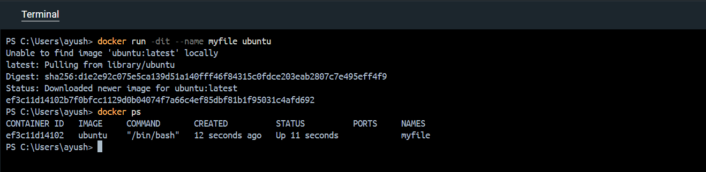
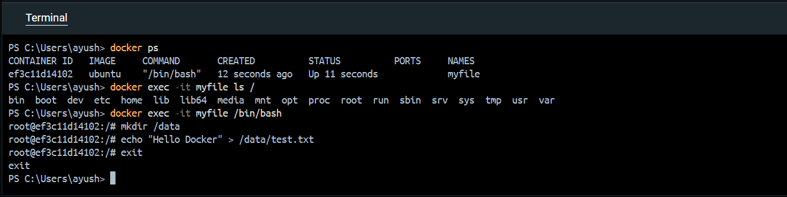
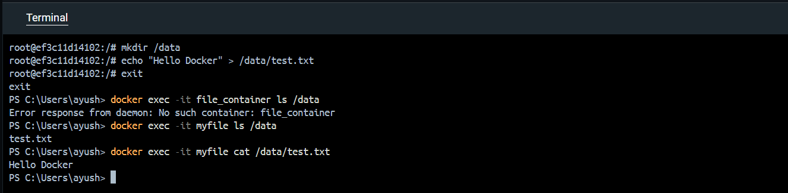

# Interaction & File Operations
Docker provides commands that allow users to execute commands inside a running container.
This makes it possible to manage files, create directories, and inspect container contents without stopping the container.

### Start a container first
```bash
docker run -dit --name file_container ubuntu
```
List running containers
```bash
docker ps
```

### List root directory inside the container
```bash
docker exec -it file_container ls /
```
### Open bash shell inside the container
```bash
docker exec -it file_container /bin/bash
```
### Create a directory inside the container
```bash
mkdir /data
```
### Create a file inside the directory
```bash
echo "Hello Docker" > /data/test.txt
```
Exit the container shell
```bash
exit
```

### Verify the file inside the container
```bash
docker exec -it file_container ls /data
```
### Display file contents
```bash
docker exec -it file_container cat /data/test.txt
```

