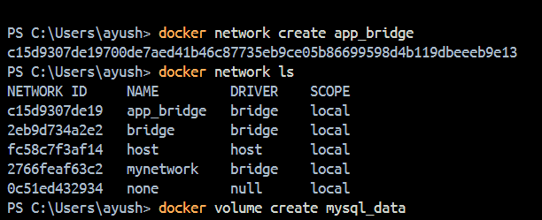
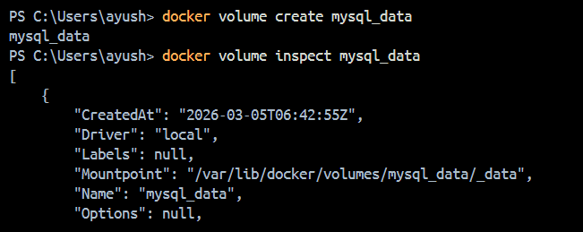
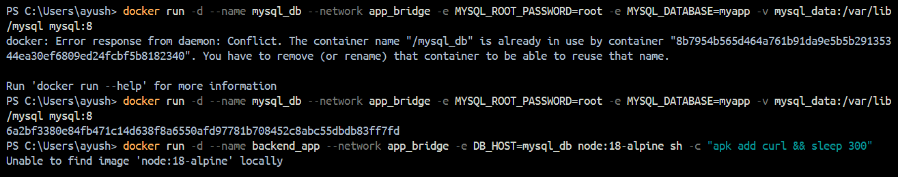
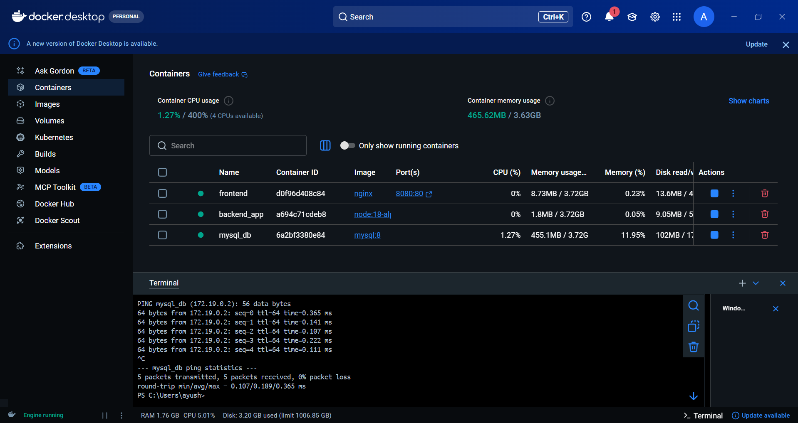
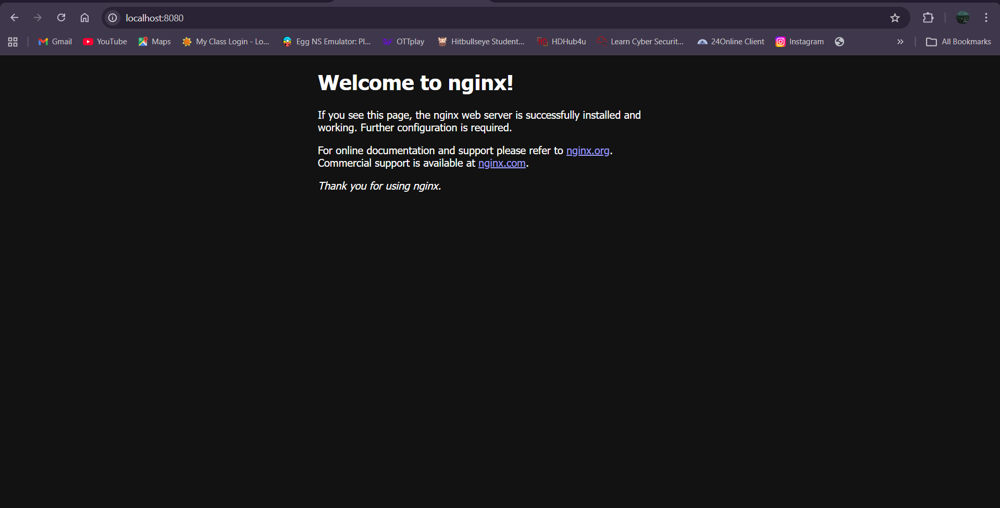

# Docker Multi-Container Lab

A Docker Multi-Container setup involves running multiple containers that work together to form a complete application. Instead of putting everything in one container, different services such as a web server, database, and backend application are placed in separate containers.

These containers communicate with each other through Docker networking, allowing them to function as a single system while remaining isolated. This approach follows the microservices architecture, where each container performs a specific role.

Using multiple containers improves scalability, maintainability, and flexibility, since each service can be updated or managed independently without affecting the entire application.

### Create a custom network
```bash
docker network create app_bridge
```
#### Check networks:
```bash
docker network ls
```

### Create a Docker volume for MySQL persistence
```bash
docker volume create mysql_data
```
#### Inspect volume:
```bash
docker volume inspect mysql_data
```

### Run MySQL container
```bash
docker run -d --name mysql_db --network app_bridge -e MYSQL_ROOT_PASSWORD=root -e MYSQL_DATABASE=myapp -v mysql_data:/var/lib/mysql mysql:8
```

### Run backend container
```bash
docker run -d --name backend_app --network app_bridge -e DB_HOST=mysql_db node:18-alpine sh -c "apk add curl && sleep 300"
```

### Test container communication
* Make sure backend_app is running
```bash
docker exec -it backend_app ping mysql_db
```
* Stop ping: CTRL + C

  ### Run frontend container
  ```bash
  docker run -d --name frontend --network app_bridge -p 8080:80 nginx
  ```
Now open:
http://localhost:8080



