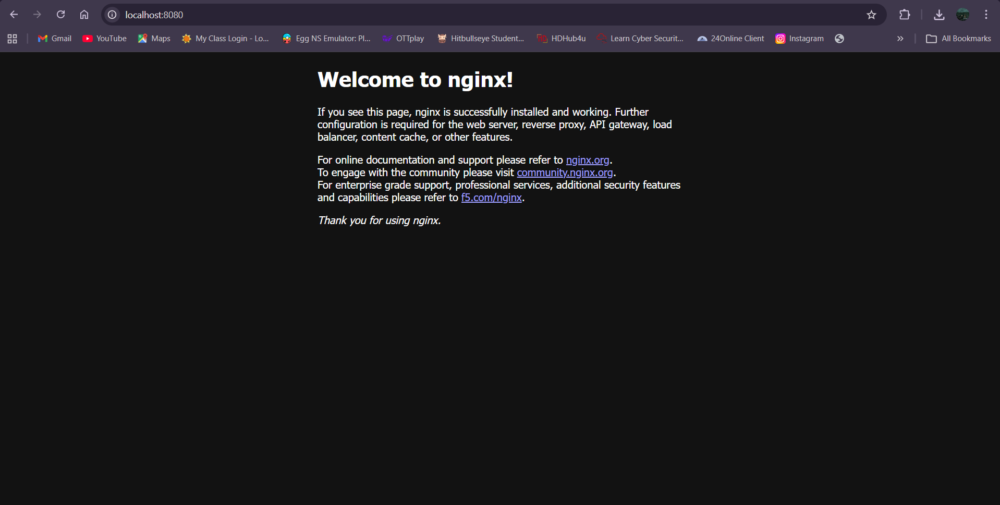
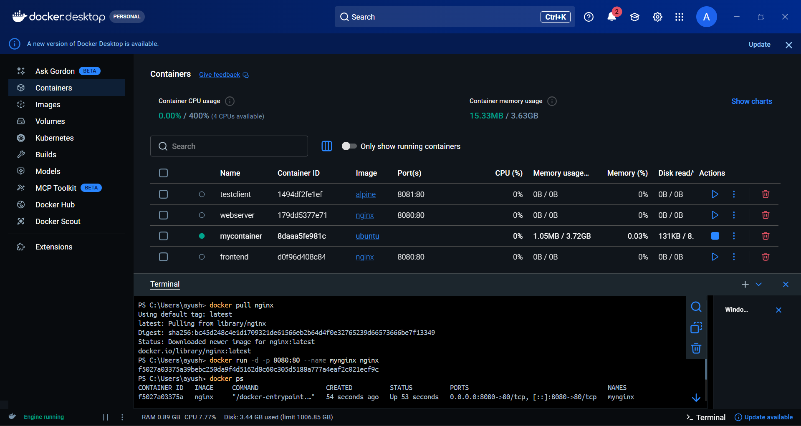
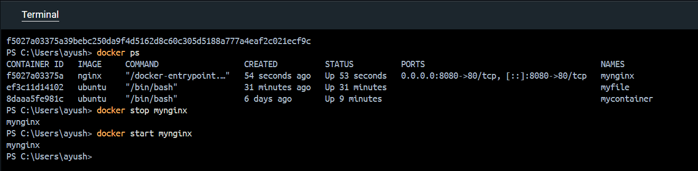

# Task: Nginx Container Lifecycle Management

## Objective
To practice pulling an image, running a container with port mapping, managing its state, and performing cleanup.

## Pull Nginx Image
```bash
docker pull nginx
```

## Run Nginx Container in Detached Mode
```bash
docker run -d -p 8080:80 --name mynginx nginx
```
#### for checking visit: http://localhost:8080



## List Running Containers
```bash
docker ps
```

## Stop the Container
```bash
docker stop mynginx
```

## Start the Container Again
```bash
docker start mynginx
```

## Remove the Container
```bash
docker rm -f mynginx
```

## Remove the Nginx Image
```bash
docker rmi nginx
```
